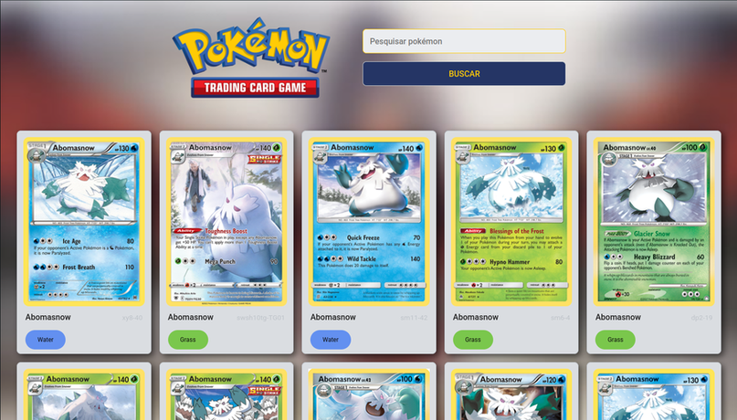
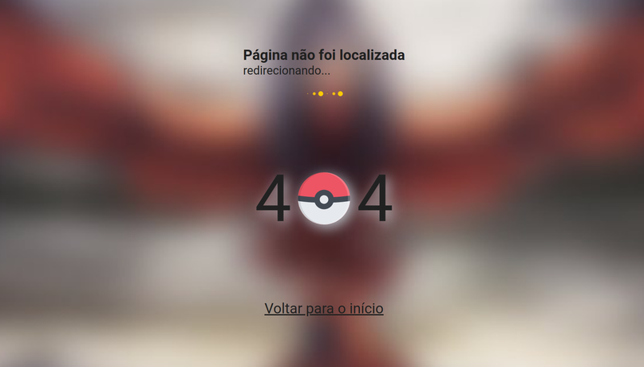
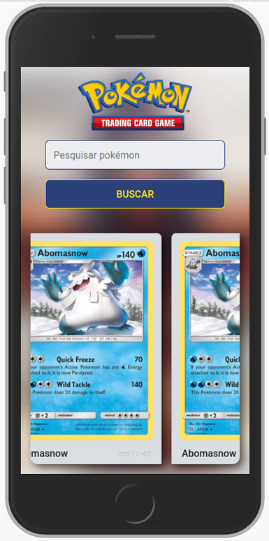

<h1 align="center">
  
</h1>
<h4 align="center">🚀 App ReactJS web consumindo API Pokémon TCG #vite #pwa #reactjs. 🚀</h4>


<p align="center">
  

  
  
  <a href="https://github.com/remulocosta/pokemon-app/commits/master">
    
  </a>

  <a href="https://github.com/remulocosta/pokemon-app/issues">
    
  </a>

  
</p>

<p align="center">
  
  
</p>
<p align="center">
  
</p>

## 🌎 Demonstração acesse:
* Vercel::  https://pokemon-app-eight-omega.vercel.app/
* 
* netlify:: https://jovial-dieffenbachia-7c8af8.netlify.app


### 📎 Características

- [x] Listagem de cartas Pokémon TCG
- [x] Pesquisa de cartas por nome.
- [x] Exibe características do Pokémon.
- [X] Redireciona para página inicial em caso URL inválida
- [x] Progressive Web App (PWA)


## :computer: Tecnologias

Este projeto foi desenvolvido com as seguintes tecnologias:
* [vite 3.1.0](https://vitejs.dev)
* [React.js 18.2.0](https://reactjs.org/)
* [nodejs 16.17.0 LTS](https://nodejs.org/)
* [cypress Teste e2e](https://www.cypress.io)
* [vitest Teste unitário](https://vitest.dev)


## ⛏ Dependencies

* [Sass](https://sass-lang.com)
* [Redux](https://react-redux.js.org)
* [Axios](https://github.com/axios/axios)
* [React router v6](https://reactrouter.com/en/main)
* [Vite pwa](https://vite-plugin-pwa.netlify.app)
* [EsLint](https://eslint.org)
* [Prettier](https://prettier.io/docs/en/editors.html)

## :construction_worker: Como executar:

```
# Clone este repositório
$ git clone --recursive git@github.com:remulocosta/pokemon-app.git

# Vá para a pasta do projeto
$ cd pokemon-app

# Instale dependências
$ yarn 
ou 
$ npm install

# Executar servidor local em modo dev, atualmente configurado para porta 3000
$ yarn dev
ou 
$ npm run dev

# Executar checagem lint
$ yarn lint
ou 
$ npm run lint

# Executar testes unitários e e2e em modo cli
$ yarn test
ou 
$ npm run test

# Executar test e2e via browser
$ yarn e2e
ou 
$ npm run e2e

# Execute o servidor local em modo produção, a porta de acesso, será aleatória.
$ yarn build && yarn review
ou
$ npm run build && npm run preview

```
## Personalização do servidor local
* Podendo ser configurado seguindo a documentação: [server-options](https://vitejs.dev/config/server-options.html)

## Publicação de sites estáticos
*  https://vitejs.dev/guide/static-deploy.html

## Iniciando nova aplicação com vite
* https://vitejs.dev/guide/


## ❔ Dúvidas
Se houver alguma dúvida sobre este repositório, envie para remulo.costa@gmail.com

Made with ❤︎ by Remulo Costa

Give a ⭐️ if this project helped you!